# How to run locally?

1. Clone the repository 
2. Run `yarn` to install all the required packages.
3. Run `yarn dev` to start server for development mode.

# Change the default version

Refer [this](https://github.com/open-metadata/docs-v1/pull/135) PR to change the default version for the `version selector` on the top navigation bar

# Docs with Markdoc

To add content to the docs use markdown files. Some custom markdoc tags are listed below for adding content with predefined styling.

### How to use markdoc tags ?

Similar to the normal react components, custom tags can be used as follows
Example: Here's how to use tag named 'exampleTag' with some attributes

```
   <!-- starting tag with attributes -->
This is content inside tag.
   <!-- closing tag -->
```

**Note** that for passing the values in string type attribute, always use **Double Quotes** (`"`) and not Single Quotes (`'`) as it's done in the above example

# Custom Tags

Here are the custom markdoc tags to use for desired functionalities.

- [Common Tags](#common-tags)
   - [1. partial](#1-partial)
   - [2. note](#2-note)
   - [3. codeWithLanguageSelector](#3-codeWithLanguageSelector)
   - [4. extraContent](#4-extraContent)
   - [5. connectorDetailsHeader](#5-connectorDetailsHeader)
   - [6. connectorInfoCard](#6-connectorInfoCard)
   - [7. connectorsListContainer](#7-connectorsListContainer)
- [Tags for Code Preview Functionality](#tags-for-code-preview-functionality)
   - [1. codePreview](#1-codePreview)
   - [2. codeInfoContainer](#2-codeInfoContainer)
   - [3. codeInfo](#3-codeInfo)
   - [4. codeBlock](#4-codeBlock)
- [Tags for Showing Step by Step Information](#tags-for-showing-step-by-step-information)
   - [1. stepsContainer](#1-stepsContainer)
   - [2. step](#2-step)
   - [3. stepDescription](#3-stepDescription)
   - [4. stepVisualInfo](#4-stepVisualInfo)
- [APIs & SDKs page tags](#apis--sdks-page-tags)
   - [1. apiPageContainer](#1-apiPageContainer)
   - [2. apiInfoContainer](#2-apiInfoContainer)
   - [3. apiVisualInfo](#3-apiVisualInfo)
   - [4. apiDescription](#4-apiDescription)
- [Inline Callout](#inline-callout)
   - [1. inlineCalloutContainer](#1-inlineCalloutContainer)
   - [2. inlineCallout](#2-inlineCallout)
- [Tile](#tile)
   - [1. tilesContainer](#1-tilesContainer)
   - [2. tile](#2-tile)

---

## Common Tags

- [1. partial](#1-partial)
- [2. note](#2-note)
- [3. codeWithLanguageSelector](#3-codeWithLanguageSelector)
- [4. extraContent](#4-extraContent)

### 1. partial

The partial tag helps in reducing the repetition in the content. If a set of lines are being used in multiple pages, you can use this tag to prevent adding same lines in multiple files.
**You can also pass variables for some varying content. Learn more about that [here](https://markdoc.dev/docs/partials#passing-variables)**

#### Steps to use

1. Add the repeating content in a file inside **"content/partials"** folder. You can also add nested structure inside the "partials" folder.
Lets say you created a file named 'test.md' inside a path `content/partials/folder1/folder2` with content -

```
### repeating line

This is the repeating line 1

This is the repeating line 2
```

2. Now just use the partial tag in some other file like this
```
# This is the parent file



and some other content
```

And this is how the parent file will render 

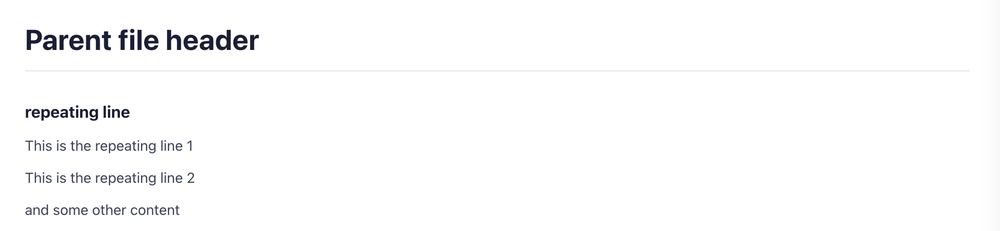

### 2. note

A tag for highlighting some part of the content.

#### Attributes

1. noteType (type - String)
   Mention the type of note you want to show. There are 3 types of note which differ in styling.

**If no attribute is passed then the default type will be considered as "Note"**

Example:

- Note


A Note


**OR**


A Note


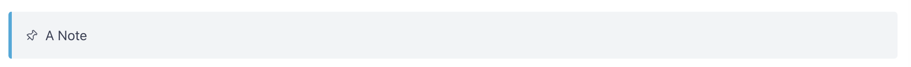

- Warning


A Warning


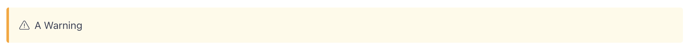

- Tip


A Tip


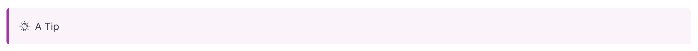

### 3. codeWithLanguageSelector

A tag to display specific code snippets with the selected language from the given language options.
Include code snippets for all the languages given in the `languagesArray` inside the opening and closing tag with proper syntax as given in the example below.

#### Attributes

1. title (type - String)
   Title to show for the language selector component.

2. languagesArray (type - Array<string>)
   An array of language codes. This array will determine how many and what tabs to display for selection. Use similar 'language codes' that are used for highlighting the code in the markdown fence nodes.
   example: java, python, javascript, json, etc.

3. id (type - String)
   Id should be unique for all the 'codeWithLanguageSelector' tags within a single page.

4. theme (type - String)
   This is an optional argument to choose the color theme for the code block.
   Available options are 'gray', 'light' and 'default'

Example:



\`\`\`json
{
  "a": {
    "c": "open",
    "num": 5,
    "val": false
  }
}
 \`\`\` 

\`\`\`python
def my_function():
  print("Hello world!")
 \`\`\` 

\`\`\`java
public class Main {
  static void myMethod() {
    System.out.print("Hello world!")
  }
}
 \`\`\` 

\`\`\`bash
curl https://google.com -a
 \`\`\` 



#### Images of `codeWithLanguageSelector` tag with different themes

1. Default


2. Light


3. Gray

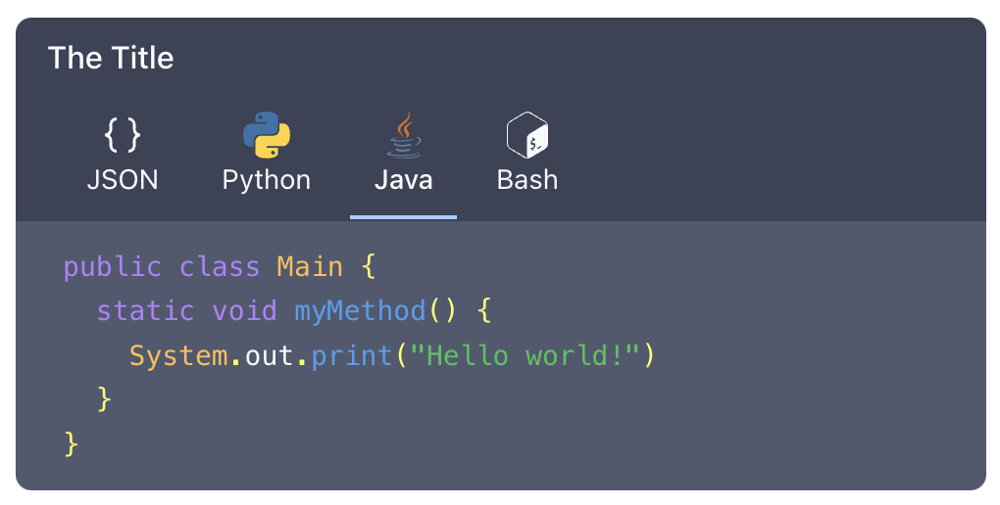

### 4. extraContent

Tag to add some extra information in between two steps. This tag can be used inside either the `codePreview` tag or the `stepsContainer` tag. To use it inside above tags, add it in between two `codeInfo` or `step` tags respectively. More detailed examples to use `extraContent` are given below, in the above mentioned tags sections.

#### Attributes

1. parentTagName (type - String)
   The name of the tag you are using it in. For example 'codePreview' or 'stepsContainer'

### 5. connectorDetailsHeader

Tag to show a styled heading for connectors with the connector Icon, development stage, platform availability and feature status.

#### Attributes

1. name (type - String)
   The name of the container in startCase.

2. stage (type - String)
   The development stage of the connector.
   It should be one of two values "PROD"(default value) or "BETA".

3. platform (type - String)
   The platform the connector is available in to.
   It should be one of two values "OpenMetadata"(default value) or "Collate".

4. availableFeatures (type - Array<string>)
   The list of available features for the connector such as "Query Usage", "Lineage" etc.

5. unavailableFeatures (type - Array<string>)
   The list of unavailable features for the connector such as "DBT", "Owners" etc

### 6. connectorInfoCard

A styled card to show the links to navigate users to the connector details page with a little information about the connector. 

#### Attributes

1. name (type - String)
   The name of the container in startCase.

2. stage (type - String)
   The development stage of the connector.
   It should be one of two values "PROD"(default value) or "BETA".

3. href (type - String)
   The relative path of the connector details page.

4. platform (type - String)
   The platform the connector is available in to.
   It should be one of two values "OpenMetadata"(default value) or "Collate".

### 7. connectorsListContainer

A wrapper tag to envelope the connectorInfoCard tags for a grid view.

---

## Tags for Code Preview Functionality

For showing code or commands with the explanations by side use following tags:-

- [1. codePreview](#1-codePreview)
- [2. codeInfoContainer](#2-codeInfoContainer)
- [3. codeInfo](#3-codeInfo)
- [4. codeBlock](#4-codeBlock)

### 1. codePreview

Its a container which will have two tags as child 'codeInfoContainer' and 'codeBlock'

### 2. codeInfoContainer

Container tag for all the 'codeInfo' tags

### 3. codeInfo

It's a tag for which will contain explanation or information about a chuck of code. Use as many tags as many steps you want inside the 'codeInfoContainer' tag.

#### Attributes -

1. srNumber (type - Number)
   It is the step number and the code chunk number you want to highlight for the given information.
   
**Note: srNumber is also a unique id to identify a code block. Make sure that you have srNumber values unique on a single page. That is even if multiple codePreview components are used in a page, the srNumbers should all be unique and should not repeat on a single page.**

### 4. codeBlock -

A container tag to enclose all the code chunks you will write for each steps given with 'codeInfo' tag. Make sure to maintain the same order you want 'codeInfo' tags to be associated with it.

#### Attributes - 

1. fileName (type - String)
   This is an optional argument. Pass the name of the file in which the code given inside the `codeBlock` tag is supposed to be.

2. theme (type - String)
   This is an optional argument to choose the color theme for the code block.
   Available options are 'gray', 'light' and 'default'

#### code/fence node (```)

Please make sure to pass an argument **srNumber** to the code node to link with the respective codeInfo section. This will determine which code block to highlight for which codeInfo section.
Here is how you can pass the argument:

\`\`\`bash 
print('hello!')
\`\`\`

Example:






Information about 1st code chunk.



Some extra information



Information about 2nd code chunk



Information about 3rd code chunk






\`\`\`bash 
Code for first codeInfo tag
\`\`\`

\`\`\`bash
Code without reference
\`\`\`

\`\`\`bash 
Code for second codeInfo tag
with 3 lines
print('Hello world!')
\`\`\`

\`\`\`bash 
Code for third codeInfo tag
with 4 lines
print('Hello There')
print('This is block 3')
\`\`\`





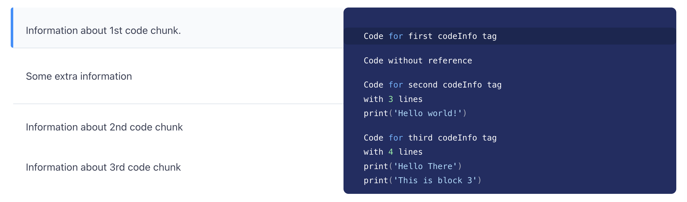

##### Here's the preview of the Code Preview functionality

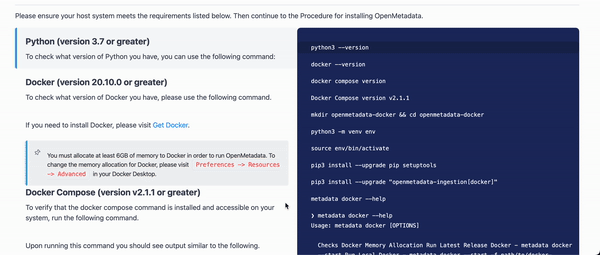

---

## Tags for Showing Step by Step Information

- [1. stepsContainer](#1-stepsContainer)
- [2. step](#2-step)
- [3. stepDescription](#3-stepDescription)
- [4. stepVisualInfo](#4-stepVisualInfo)

### 1. stepsContainer

A container to envelope all the tags for stepper functionality. Ensure to include only below tags inside this tag.

### 2. step

Use this tag to define the contents of a single step.

#### Attributes

1. srNumber (type - Number)
   It is the serial number of the step. It is used to identify which step to highlight with scrolling.

### 3. stepDescription

The description about the step. The title and the details about step should be included in this tag.
For defining title use 'title' attribute. Add other information between opening and closing tags.

#### Attributes

1. title (type - String)
   Title of the step.

### 4. stepVisualInfo

Use this tag to show images, videos, GIFs or CodeBlocks to provide additional information for the step.
Add the tags for images, videos, GIFs or CodeBlocks between opening and closing tags.

Example:







Step 1 description













Additional information between two steps







Step 1 description













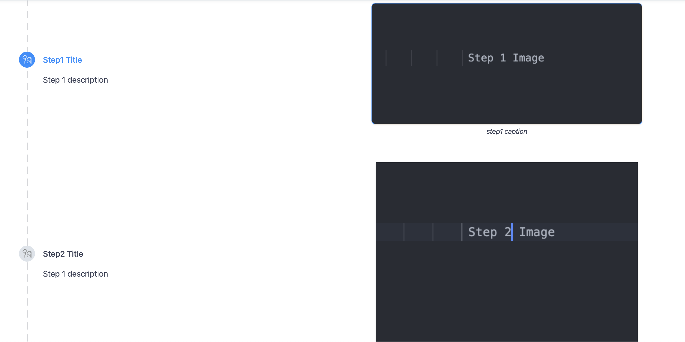

##### Here's the preview of the Stepper functionality


---

## APIs & SDKs page tags

Use following 4 tags to achieve the API page layout and functionalities.

- [1. apiPageContainer](#1-apiPageContainer)
- [2. apiInfoContainer](#2-apiInfoContainer)
- [3. apiVisualInfo](#3-apiVisualInfo)
- [4. apiDescription](#4-apiDescription)

### 1. apiPageContainer

A container tag to wrap all the content tags for API page layout.

### 2. apiInfoContainer

A container tag to envelop "apiVisualInfo" and "apiDescription" tags

### 3. apiVisualInfo

A tag to display visual information about APIs. May contain an Image or a code block.

### 4. apiDescription

A tag to show description about the API.

Example:







\#\# Title 1
API description







```
This is a new code
```











\#\#\# SubTitle
API description 2







```
This is a new code
```











\#\# Title 2
API description 2







```
This is a new code
```









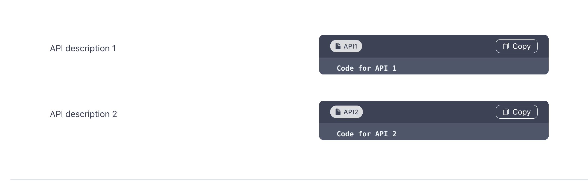

### Preview of API page

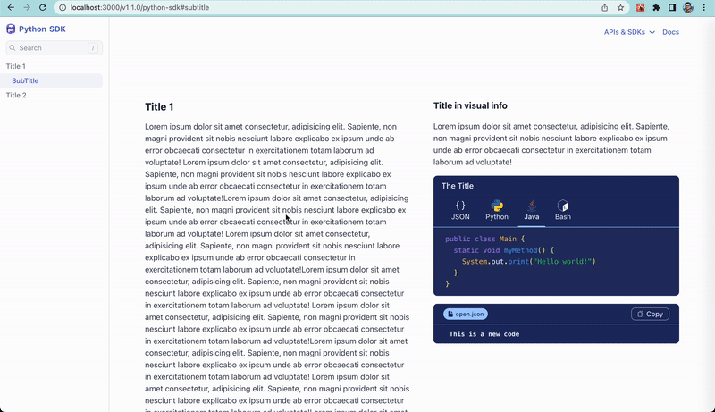

---

## Inline Callout

- [1. inlineCalloutContainer](#1-inlineCalloutContainer)
- [2. inlineCallout](#2-inlineCallout)

### 1. inlineCalloutContainer

A container tag to envelope `inlineCallout` tags for the grid view.

### 2. inlineCallout

A styled, open component, with icons, to navigate to pages.

#### Attributes

1. icon (type - String)
   Name of the custom icon (celebration | fit_screen) or the identifier string to render the icons from 'Material Icons'. Visit https://react-icons.github.io/react-icons/icons?name=md to checkout the available icon.

2. bold (type - String)
   The content that should be written in bold.

3. href (type - String)
   The link which the tag will redirect to.

4. isExternalLink (type - Boolean)
   To determine whether the given `href` value refers to an external website page. 
   Pass `false` if the link refers to a page from the documentation and the `href` has a relative path and `true` if the entire path is provided in `href`.

Example:




The first description 1.



The first description 2.



The first description 3.




#### Preview of Inline Callout 

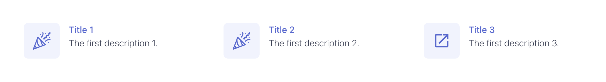

---

## Tile

- [1. tilesContainer](#1-tilesContainer)
- [2. tile](#2-tile)

### 1. tilesContainer

A container tag to envelope `tile` tags for the grid view.

### 2. tile

A styled, bordered component, with or without icons, to navigate to pages.

#### Attributes

1. icon (type - String)
   Name of the custom icon or the identifier string to render the icons from 'Material Icons'. Visit https://react-icons.github.io/react-icons/icons?name=md to checkout the available icon

   Available Custom Icons:
   - administration
   - collaboration
   - discovery
   - governance
   - insight
   - lineage
   - quality
   - steward

2. title (type - String)
   The title or the header of the tile.

3. description (type - String)
   Some description about the page the tile is referring to. 

3. link (type - String)
   The link which the tile will redirect to.

4. isExternalLink (type - Boolean)
   To determine whether the given `href` value refers to an external website page. 
   Pass `false` if the link refers to a page from the documentation and the `href` has a relative path and `true` if the entire path is provided in `href`.












#### Preview of Tile

**Tiles without the icons**

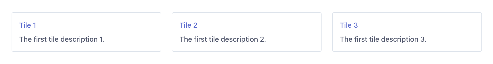

**Tiles with the icons**

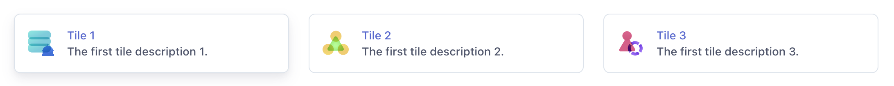
